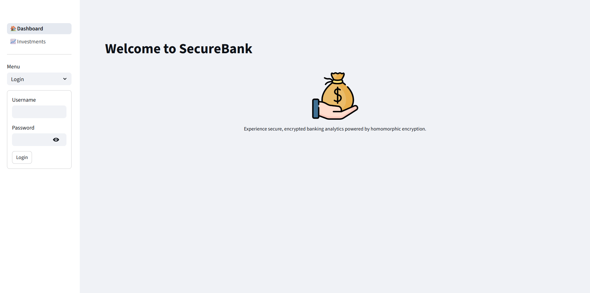
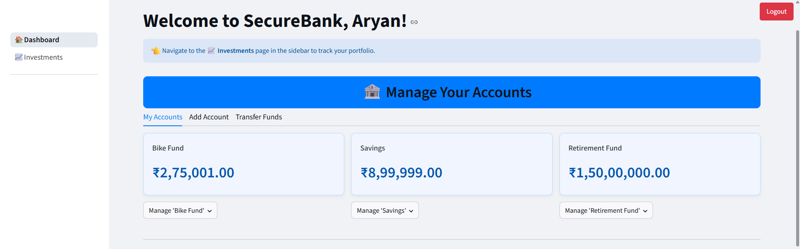
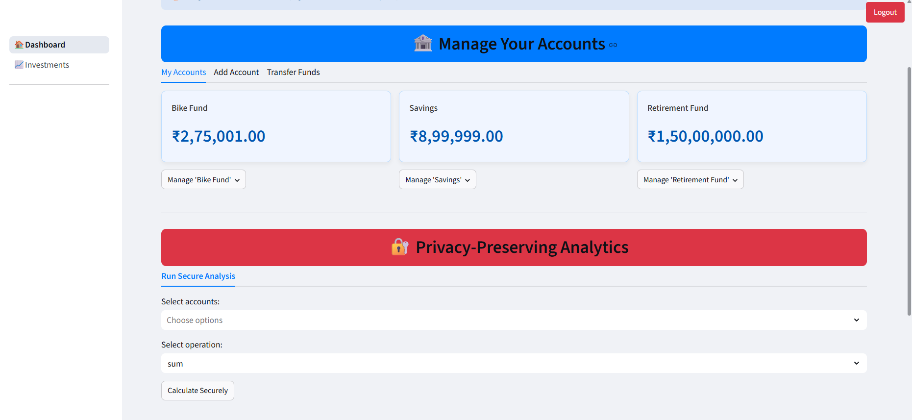
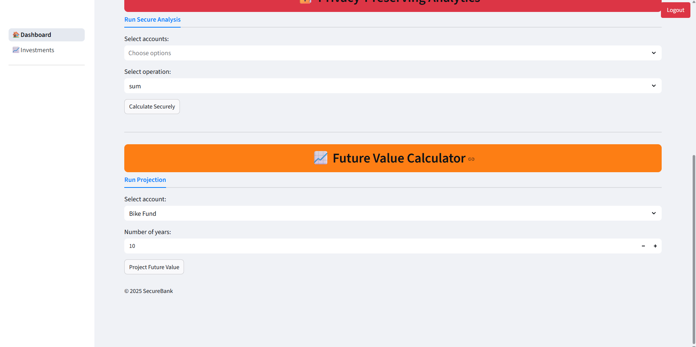
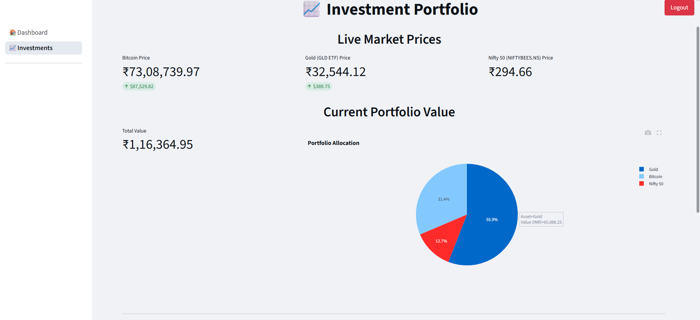
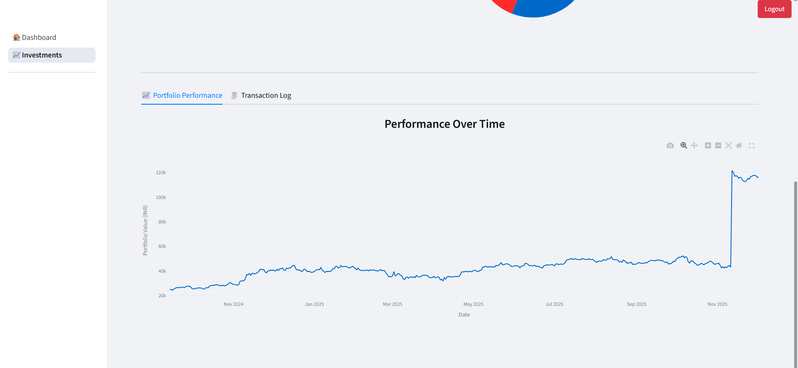

# 🏦 SecureBank: Privacy-Preserving Finance Dashboard

A full-stack personal finance application featuring homomorphic encryption for privacy-preserving analytics. Built with **Flask** (Backend) and **Streamlit** (Frontend).

## 📸 Screenshots

### 🔐 Authentication
| Secure Login Page |
| :---: |
|  |

### 🏠 Main Dashboard
| Account Overview | Transfer Funds | Future Value Projector |
| :---: | :---: | :---: |
|  |  |  |

### 📈 Investments & Analytics
| Live Market Data | Portfolio Performance |
| :---: | :---: |
|  |  |

---

## ✨ Features

### 🛡️ Security First
- **Homomorphic Analytics:** Calculate portfolio aggregates (Sum/Average) on the server without ever decrypting the user's balance using the Paillier cryptosystem.
- **AES-256 Encryption:** All sensitive database entries (account names, balances, transaction details) are encrypted at rest.
- **JWT Authentication:** Secure session management with auto-logout features.

### 💰 Banking Features
- **Account Management:** Create accounts, view balances, and delete accounts.
- **Atomic Transfers:** Securely transfer funds between accounts with transaction safety.
- **Future Value Calculator:** Frontend simulation to project account growth based on compound interest.

### 📈 Investment Portfolio
- **Real-Time Data:** Tracks Bitcoin, Gold, and Nifty 50 prices using `yfinance`.
- **Performance Tracking:** Interactive Plotly charts showing portfolio value over time.
- **Transaction Log:** Detailed history of all investment purchases.

## 🛠️ Tech Stack

- **Frontend:** Streamlit, Plotly, Pandas
- **Backend:** Flask, MySQL, PyJWT
- **Cryptography:** `phe` (Paillier), `cryptography` (Fernet/AES)
- **Data:** `yfinance` API

## 🚀 How to Run Locally

### 1. Clone & Install
```bash
git clone [https://github.com/YOUR_USERNAME/secure-bank-dashboard.git](https://github.com/YOUR_USERNAME/secure-bank-dashboard.git)
cd secure-bank-dashboard
pip install -r requirements.txt
```

### 2. Database Setup
Ensure your local MySQL server is running, then initialize the tables:
```bash
python backend/database.py
```

### 3. Environment Variables
Create a `.env` file in the `backend/` folder with your local secrets:
```text
DB_HOST=localhost
DB_USER=root
DB_PASSWORD=your_password
DB_NAME=banking
JWT_SECRET_KEY=your_secret_key
ENCRYPTION_KEY=your_generated_key
```

### 4. Run the Application
Open two separate terminal windows:

**Terminal 1 (Backend API):**
```bash
python backend/app.py
```

**Terminal 2 (Frontend Dashboard):**
```bash
streamlit run "frontend/_🏠_Dashboard.py"
```
